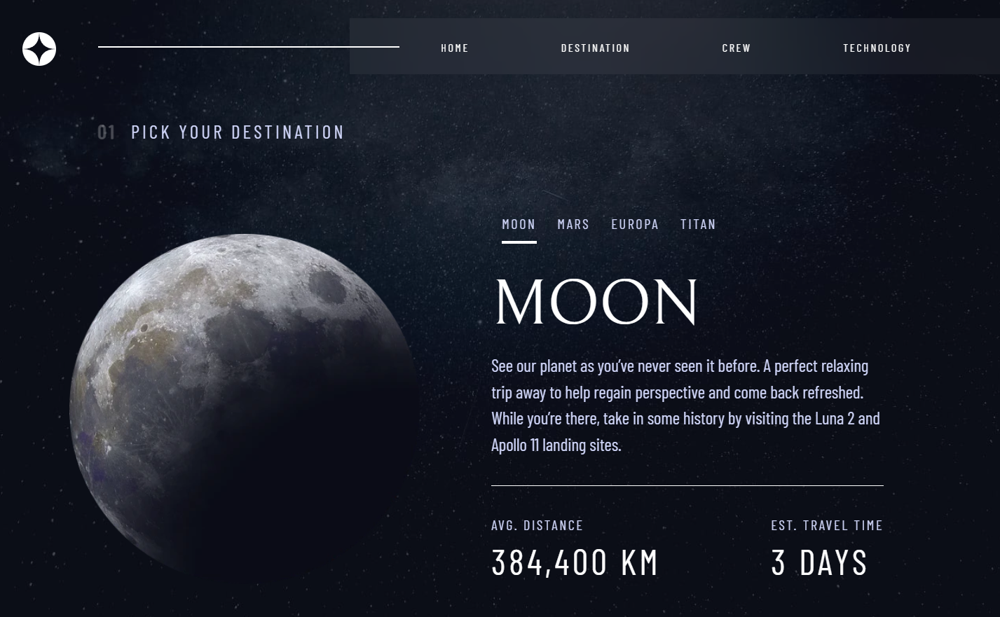

# Space-Tourism-website

## Welcome

This multi-page website is a simple responsive SPA built with react/react-router, typescript and tailwind.

The challenge comes from frontend mentor: [here](https://www.frontendmentor.io/challenges/space-tourism-multipage-website-gRWj1URZ3/hub)

## Screenshots

| Desktop                                                            | Tablet                                                            | Mobile                                                            |
| ------------------------------------------------------------------ | ----------------------------------------------------------------- | ----------------------------------------------------------------- |
|                |                |                |
|  |  |  |

# Tech Stack

   

## Author

- [@Ethanosaure](https://www.github.com/Ethanosaure)
